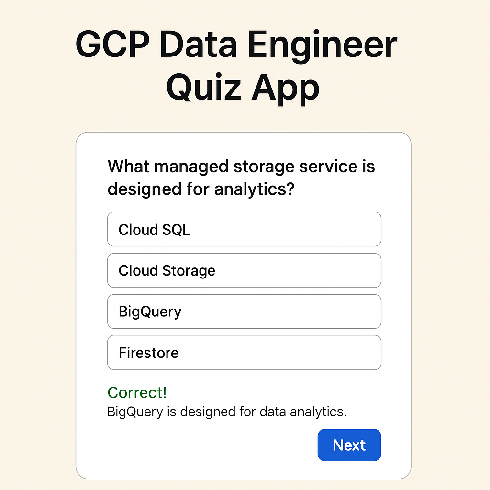

# GCP Certification Quiz App  
*A bilingual quiz app to prepare for the Google Cloud Professional Data Engineer exam.*  
*Una aplicación bilingüe para prepararse para la certificación GCP Data Engineer.*


---

## 🌐 Live Demo / Demostración en vivo

[**▶️ Launch App on Vercel**](https://gcp-dataengineer-studytool.vercel.app/)

<<<<<<< HEAD
=======

---

## 🖼️ App Preview / Vista previa




>>>>>>> 28a552905cfbc5cc00988ad637fba56f76ee7d24
---

## ✨ Features / Características

### Core Functionality

- 📚 **100+ exam-style questions** in JSON
- 🎯 **Two modes**: Study (retry) & Exam (timed)
- ⏱️ Timer and score tracking
- 🧠 Immediate feedback & explanations
- 🌐 Bilingual (English / Español)
- 📱 Fully responsive UI
- 📊 Score log

### Funcionalidad principal

- 📚 **100+ preguntas tipo examen** en JSON
- 🎯 **Dos modos**: Estudio (reintento) y Examen (tiempo)
- ⏱️ Temporizador y puntuación
- 🧠 Feedback inmediato y explicaciones
- 🌐 Bilingüe (Inglés / Español)
- 📱 Interfaz adaptable
- 📊 Historial de resultados

---

## 🛠️ Tech Stack / Tecnologías

- **Lenguaje / Language:** JavaScript
- **Framework:** React
- **Routing:** React Router DOM
- **Estilos / Styles:** CSS
- **Despliegue / Deployment:** Vercel
- **Formato de datos / Data Format:** JSON

---

## ⚙️ Quick Start / Inicio rápido

### 📥 Clone the repository / Clonar repositorio

```bash

git clone https://github.com/Marie-25hue/gcp-dataengineer-studytool.git
cd gcp-dataengineer-studytool

```

### 📦 Install dependencies / Instalar dependencias

```bash
npm install
```

### ▶️ Run locally / Ejecutar en local

```bash
npm start
```

### ✅ Run tests / Ejecutar tests

```bash
npm test
```

### 🏗️ Build for production / Build para producción

```bash
npm run build
```

---

## 🚀 Deployment / Despliegue

Deploy con Vercel:

```bash
vercel --prod
```

O hacé click en:

[](https://vercel.com/import/project)

---

## 🤝 Contributing / Contribuciones

**We welcome contributions!**  
**¡Agradecemos contribuciones!**

1. Fork this repo / Haz un fork  
2. Create your feature branch / Crea tu rama  
3. Commit your changes / Hacé commit  
4. Push and open a PR / Subí y abrí un Pull Request  

Check `CONTRIBUTING.md` for more details.  
Consulta `CONTRIBUTING.md` para más detalles.

---

## 📄 License / Licencia

**MIT License**  
Libre para usar, modificar y compartir.  
See LICENSE for full details.

---

## 🛟 Support / Soporte

Found a bug or want to suggest an improvement?  
¿Encontraste un bug o querés proponer una mejora?

[➡️ Open an Issue](https://github.com/Marie-25hue/gcp-dataengineer-studytool/issues)

---

> 🚧 Esta es la versión base estable. La versión extendida con historial, badges, y feedback personalizado está en desarrollo.

